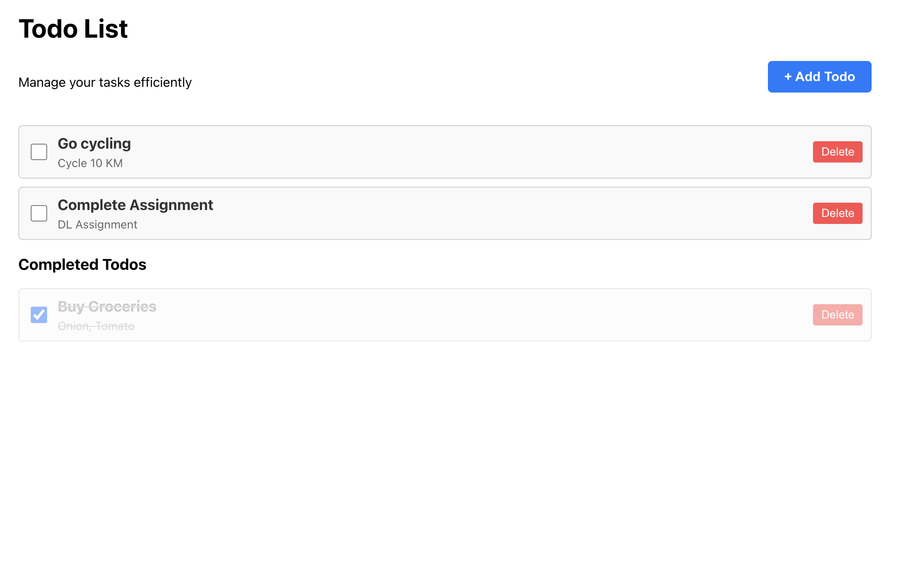

# TODO App

## Overview
This is a simple Task Manager web application built using React and TypeScript. The app allows users to manage their tasks efficiently by adding, deleting, and marking tasks as completed. Completed tasks are visually distinguished with a strikethrough effect.

## Features
- **Add a Task**: Users can add a new task with a title and description using a modal popup.
- **Delete a Task**: Users can delete a task from the list.
- **Mark a Task as Completed**: Users can mark tasks as completed using a checkbox.
- **View Tasks**: Users can view all tasks, with completed tasks visually distinguished.

## Implementation Details

### State Management
The app uses React's useState hook to manage the following states:
- `todos`: Array of all tasks
- `showModal`: Boolean to control the visibility of the add task modal
- `newTodo`: Object containing the title and description of a new task

### Key Components
1. **App.tsx**: The main component that maintains the state and renders the UI.
2. **TodoListTile**: A reusable component for displaying individual tasks.
3. **AddTodoModal**: A modal component for adding new tasks.

### Core Functionality
- **Adding Tasks**: Click the "Add Todo" button to open a modal, enter task details, and save.
- **Completing Tasks**: Click the checkbox to mark a task as completed.
- **Deleting Tasks**: Click the "Delete" button to remove a task.
- **Task Display**: Completed tasks are visually distinguished with strikethrough text and reduced opacity.

## Setup and Installation

### Prerequisites
- Node.js (v16+)
- npm or yarn

### Steps to Run the Project
1. Clone the repository:
   ```bash
   git clone https://github.com/Kapish26/todo-app.git
   cd todo-app

2. Install dependencies:
   ```bash
   npm install
   # or
   yarn install
   ```
3. Start the development server:
   ```bash
   npm start

4. Open your browser and navigate to `http://localhost:3000` to view the app.

### Available Scripts
In the project directory, you can run:
- `npm start`: Runs the app in development mode at http://localhost:3000.
- `npm run build`: Builds the app for production to the `build` folder.


## Usage Guide

### Adding a new task
1. Click the "+ Add Todo" button
2. Enter a title and description in the modal
3. Click "Save" to add the task to your list

### Marking a task as completed
- Click the checkbox next to the task to toggle its completion status
- Completed tasks will appear with a strikethrough effect and in a separate "Completed Todos" section

### Deleting a task
- Click the "Delete" button on a task to remove it from the list

## Screenshots
### Add Task Modal

### Task List

### Completed Tasks


## Design Decisions

### Component Structure
The app follows a component-based architecture for better modularity and maintainability. Each component has its own styles and type definitions.

### Styling
CSS is used for styling with a clean, minimalist design. Completed tasks are visually distinguished with strikethrough text and reduced opacity.

### TypeScript Integration
TypeScript is used throughout the app to ensure type safety and improve developer experience.
